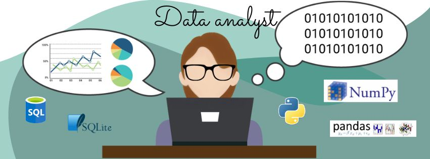
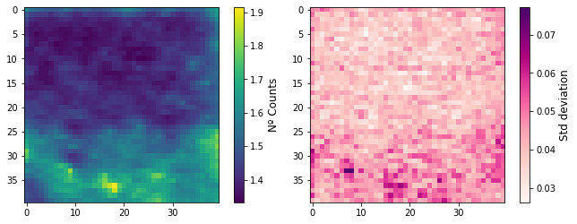

<h1 align="center"> Hi there, I'm Juli 👋   Welcome to my GitHub
 </h1>

 

## About me:

- 🔭 I’m currently working on Visualization tools.
- 🌱 I’m currently learning Python and SQL.
- 👯 I’m looking to collaborate on Data Analytics projects.
- 🤔 I’m looking for help with job search for full-time positions.
- 💬 Ask me about any concerns you may have on PhD lifestyle in Spain, scholarships & founding.
- 📫 How to reach me: jbaciredo@gmail.com / julibaciredo@gmail.com
- ⚡ Interests: Bioinformatics, Finance & Bussiness Intelligence, Sailing and Running.
 
<h3 align="center"> Preview of current projects 🎯💪 </h3>
 
<a href="https://github.com/jbaciredo/2Dplot_fluorescence"> 2Dplot_fluorescence     </a>
