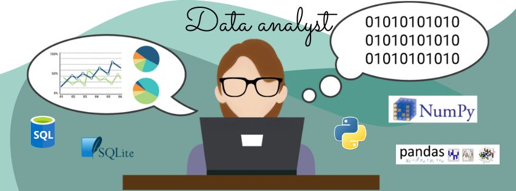
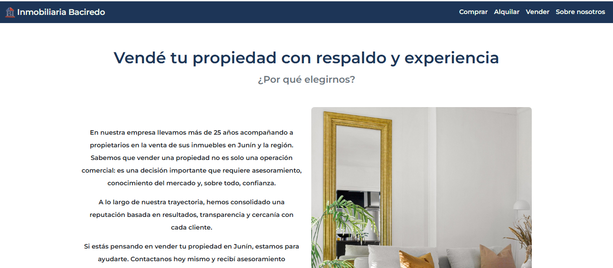
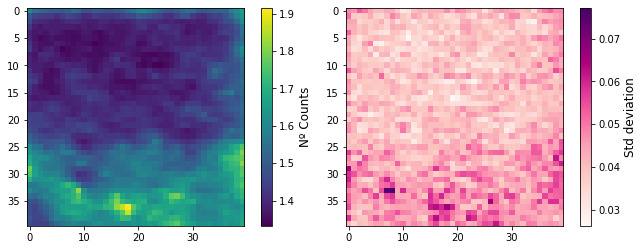
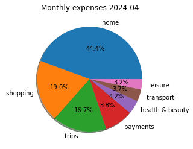

<h1 align="center"> Hola, soy Juli 👋   Bienvenid@s a mi GitHub </h1>

  

 

<h2 align="center"> Desarrollo de aplicaciones multiplataforma </h2>

## Sobre mi:
<ul>
  <li>🔭 Actualmente estoy trabajando en proyectos de desarrollo web y pequeñas herramientas de análisis de datos.</li>
  <li>🌱 Actualmente estoy aprendiendo tecnologías del ciclo de Desarrollo de Aplicaciones Multiplataforma (DAM) como Java, bases de                datos SQL, desarrollo móvil y servicios backend.</li>
  <li>👯 Busco colaborar en proyectos de desarrollo de software y análisis de datos.</li>
  <li>💼 Estoy buscando prácticas y oportunidades junior como desarrollador.</li>
  <li>💬 Pregúntame sobre Python para análisis de datos o desarrollo web con HTML, CSS y JavaScript.</li>
  <li>🏗️ He desarrollado una web para una empresa inmobiliaria desplegada en Netlify: inmobiliaria-baciredo.netlify.app</li>
  <li>🧠 Tengo experiencia práctica con Python en análisis de datos y desarrollo frontend.</li>
  <li>📂 Puedes ver mis proyectos aquí: mi GitHub</li>
  <li>📫 Cómo contactarme: jbaciredo@gmail.com / julibaciredo@gmail.com</li>
  <li>⚡ Intereses: análisis de datos, desarrollo de software, tecnología y deporte.</li>
</ul>
 
<h3 align="center"> Vista previa de mis proyectos actuales 🎯💪 </h3>
 
<a href="https://inmobiliaria-baciredo.netlify.app/"> Web Inmobiliaria     </a>
 

 
<a href="https://github.com/jbaciredo/2Dplot_fluorescence"> 2Dplot_fluorescence     </a>
 

 
<a href="https://github.com/jbaciredo/getting_good_w_money"> getting_good_w_money     </a>
